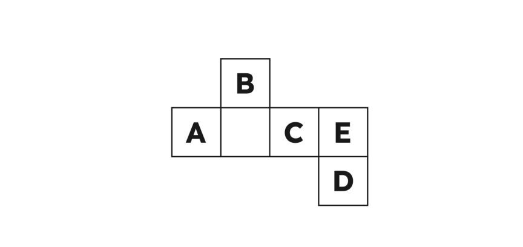

# 欢迎来到 ABCDE ZK 导论

零知识证明（ZKP）是一类重要的密码学协议，允许证明者（Prover）向验证者（Verifier）证明对某些信息的知识或拥有权，而不泄露任何额外的信息。这个强大的概念在隐私保护、区块链技术等多个领域有着众多的应用。

在本教程中，我们将介绍ZKP的基础知识，包括其历史、关键概念和常见应用。我们还将深入探讨 ZKP 的技术细节，包括其背后的数学原理和不同类型的ZKP协议。在此过程中，我们将提供实际用例，帮助您理解ZKP在实际场景中的应用。

在本教程结束时，您将对ZKP及其前沿应用有扎实的理解，同时具备进一步探索这一新兴领域的知识和技能。让我们开始探索ZKP的力量吧！

> 特别致谢杰出的 [ABCDE Capital 团队](https://www.abcde.com/).

